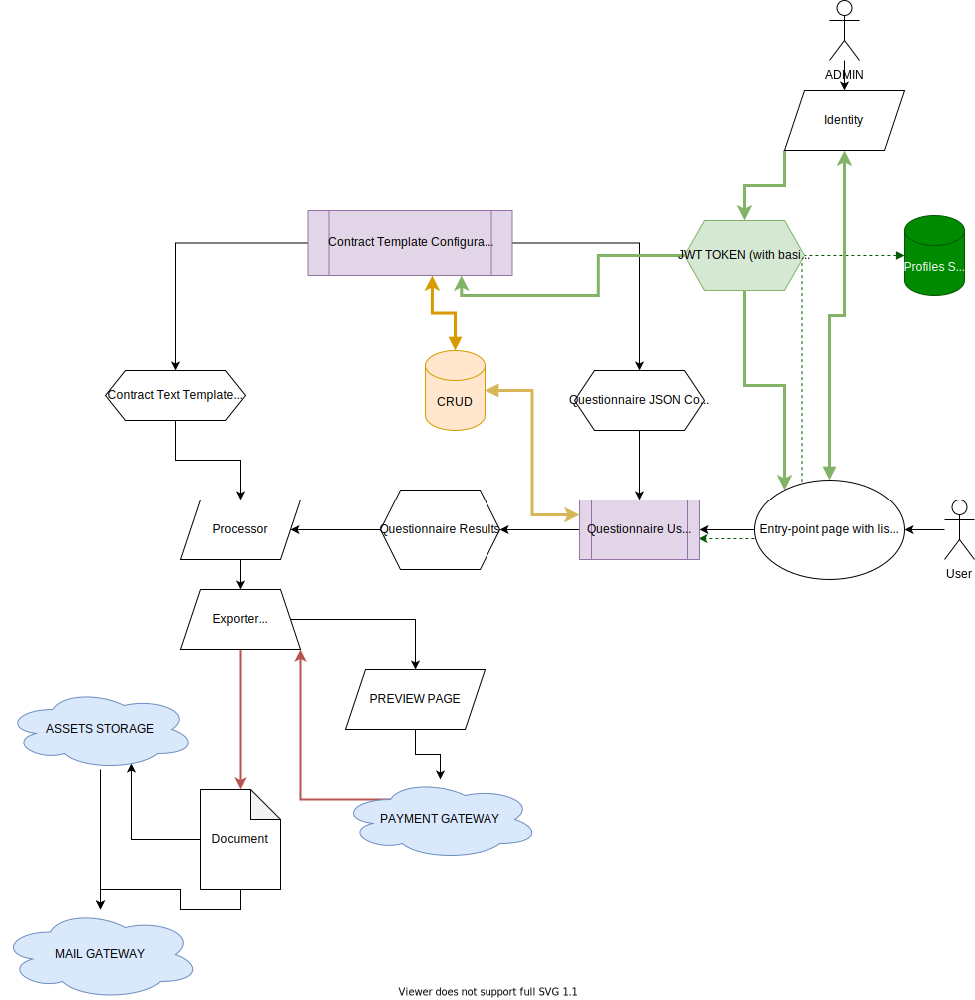

# DRAFTER High-level technical overview

> note: I will omit authentification, authorization, and caching in this doc.
> I will also assume, that so far we are not going to make multi-language contracts to simplify the initial architectural plan.

## Technologies

For **Backend**, I suggest using NodeJS, because:

1. It works well with JSON
2. All codebase will be in the same language
3. Has good integration with Mongo

However, there are risks from a performance and security point of view, which can be critical.

For **Frontend**, I would go with React.

These are rather suggestions, perhaps requires further discussions. However, the technology choose doesn't directly affect high-level architecture.

> These are just suggestions, perhaps requires further disscussions. However, technology choose doesn't directly affect high-level architecture.

## High-level entities

The general idea to achieve the ability to generate documents based on the preconfigured flexible template is to **get everything needed** for the final document:

1. _Document Template_
2. _Questionnaire Results_

Having these two entities we can put _Questionnaire Results_ into _Document Template_ and generate the final _Document_. To make it possible to get _Questionnaire Results_ we need to introduce _Questionnaire Config_.

## High-level services

I suggest using the rich-client approach. So most of the business logic is going to be in client applications.
From a technical point of view, we are going to need the following services:

1. _Document Template Editor_ - tool for administrators to prepare _Document Template_ and _Questionnaire Config_
2. _Questionnaire User Interface_ - tool for users to fill in Questionnaire and provide with _Questionnaire Results_
3. _Processing Unit_ - generates _Document_ based on _Questionnaire Results_ into _Document Template_
4. _Exporting Unit_ - generates _Document File_ based on a _Document_
5. _CRUD API_ - basically allows to read/write **entities** to the database.
6. _Identity Provider_ - trades credentials to JWT token
7. _Profile Service_ - trades token to user profile. Provides with profile editing, password change and reset.
8. _Mongo DB_ - document-oriented database should perfectly suit the document-oriented platform.



## Data model

Most of the data are going to be JSON-documents.

#### Document Template

Text flexibility is a must for such a service. The fewer limits we would have in this point, the more kinds of contracts can be provided to the customer.

That's why I suggest using flexible template language like **Handlebars JS**. The disadvantage of such an approach is the requirement for template editors to briefly understand JS.

#### Questionnaire Config

It is probably going to be a key entity of the system. The model of this entity affects many services. The general idea of this model is keeping collection of Data Input Components with their config.

It can be represented as the following JSON object:

```
{
  template: "Handlebars template UID",
  context: {
    title: "Employee Contract",
    ...
  },
  questionnaire: [{
    id: "EmployeeAge",
    editorComponent: "number",
    edtiorConfig: {
      validation: {
        min: 7,
        max: 120,
        required: true
      }
    },
  }, {
    id: "EmployeeGender",
    editorComponent: "radio",
    edtiorConfig: {
      validation: {
        required: true
      },
      options: ["MALE", "FEMALE"]
    },
  }, {
    id: "YearsInArmy",
    editorComponent: "dateRange",
    edtiorConfig: {
      maxRange: 10
    },
    rules: [{
      condition: "EmployeeAge < 18 && EmployeeGender == 'MALE'"
    }]
  }]
}
```

To achieve the flexibility of _Questionnaire UI_ the **Rules** object has been added.
It accepts the following parameters:

1. Condition (controls when input is shown): expressions with `Relational`, `Equality`, `Binary logical` operators. (maybe, `logical NOT` as well)
2. By default it is `true`

Input should support groupping, to make it's possible to control several inputs by the single rule.

> There should be much more UI-oriented data. Like hint, isRequired, default value, etc. We can discuss it later.

### Questionnaire Results

Can be easily represented as:

```
[{
  type: "dateRange",
  id: "YearsInArmy"
  value: {
    startDate: "dd-mm-yyyy",
    endDate: "dd-mm-yyyy"
  }
}, ...]
```

If the block was hidden due to rules, the value is set to _null_.

# Client-side applications

The key idea of these two client-side applications is to build a _Questionnaire_ and to get its results.
To accomplish this I would introduce the concept of **UI Data Component**.
Which is consist from two parts: _Configiration Component_ and _Questionnaire Data Input Component_.

Since all the data are basically JSON documents, we can easily implement versioning and auto-saving (to Mongo, and LocalStorage) for both _Template Editor_ and _Questionnaire User Interface_.

## UI Data Component

Basically consist of two parts:

1. Admin configuration component to configure component by attributes
2. Questionnaire UI component

## Document Template Editor

Provides the following functionality:

1. Fill in **Handlebars JS** _Document Template_
2. Create _Questionnaire Config_. Mainly as the set of **Configiration Components** with **rules**

## Questionnaire User Interface

Provides the following functionality:

1. Preparing _Questionnaire Results_ by filling in UI generated from _Questionnaire UI components_ based on selected _Questionnaire Config_
2. Passing this _Questionnaire Results_ and _Questionnaire Config_ to **Processing Unit**
3. Processing RULES set by _Questionnaire Config_ to apply hide/show actions to specific UI blocks

_Questionnaire UI_ should keep all user input in LocalStorage, and propose to use saved data once page is loaded.
Alternatively, if user is logged in, all data must be kept in MongoDB.
